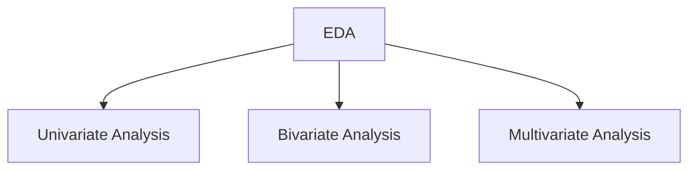

### Exploratory Data Analysis is a way to determine the main characteristics of a dataset using visualizations.

- **We'll be performing EDA on 2 types of data:

| Numerical Data       | Data that is continuous                | age, marks, salary |
| -------------------- | -------------------------------------- | ------------------ |
| **Categorical Data** | **Data that can be divided in groups** | **gender, Yes/no** |

-----
## Univariate Analysis
- **Analysis of single variable.
- **Independent Analysis on each column**
- **While performing Univariate analysis, we must strongly focus on creating graphs/charts.
